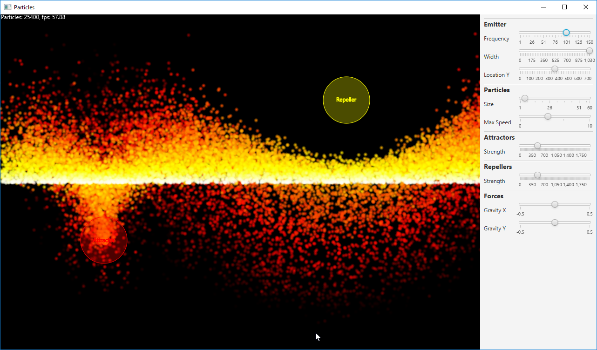

I had the idea for this project after reading the Particle Systems chapter of Daniel Shiffman's excellent book 'The Nature of Code'. This is a JavaFX implementation of his described techniques.

The implementation uses forces such as gravity, attractors and repellers. Particle properties such as size, color, etc. are parameterized via the UI.

